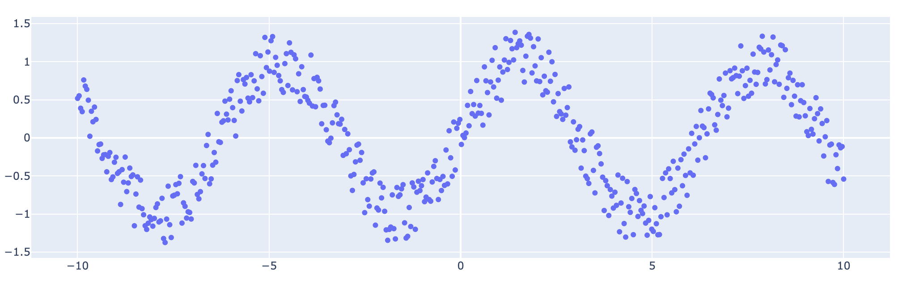
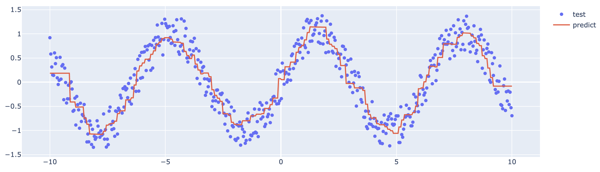
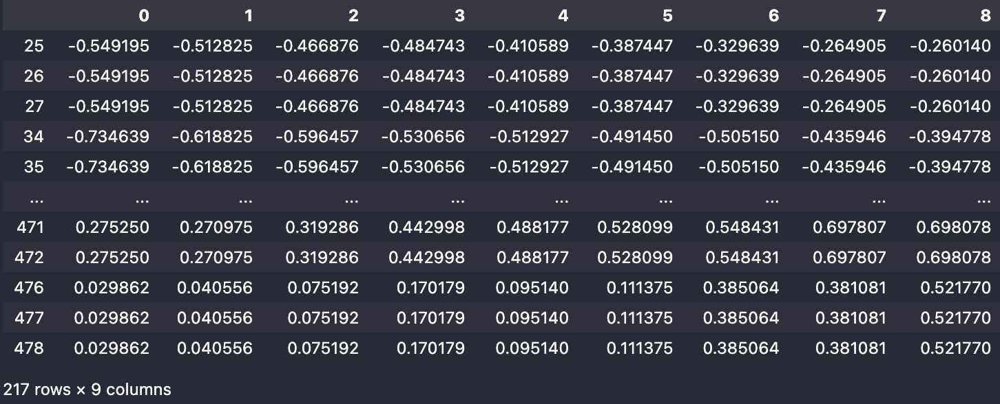
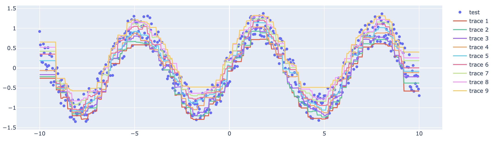

### TL;DR
LightGBM 은 Microsoft 에서 개발한 gradient boosting tree framework 로 모델 적합이 빠르고 계산량이 적어서 자주 사용된다.
LightGBM 에서는 기본적으로 quantile을 추정하는 알고리즘을 내장하고 있다.
그러나, LightGBM에는 무시하지 못할 중대한 **결함**이 있는데, 이는 마지막에 다루도록 하겠다.

### Example
예제에 사용할 데이터는 다음과 같다. 예제는 [링크](https://towardsdatascience.com/lightgbm-for-quantile-regression-4288d0bb23fd)에서 참고했다.

```python
import numpy as np

sample_size = 500
x = np.linspace(-10, 10, sample_size)
y = np.sin(x) + np.random.uniform(-0.4, 0.4, sample_size)
x_test = np.linspace(-10, 10, sample_size)
y_test = np.sin(x_test) + np.random.uniform(-0.4, 0.4, sample_size)
```

해당 데이터를 간단하게 다음과 같이 시각화 해볼 수 있다.
```python
import plotly.graph_objects as go

fig = go.Figure(go.Scatter(x=x, y=y, mode="markers"))
fig.show()
```


LightGBM 에서는 기본적으로 Quantile을 추정하는 옵션을 제공한다.
이는 다음의 두 가지 옵션을 통해 가능한데
- params에 "objective"를 "quantile"로 설정,
- "alpha"로 원하는 quantile 을 입력,

하는 방식이다. 예를 들어, 아래는 Median(`"alpha" : 0.5`)을 추정하는 모델의 구성이다.

```python
import lightgbm as lgb

params = {
    "objective": "quantile",
    "alpha": 0.5,
    "max_depth": 4,
    "num_leaves": 15,
    "learning_rate": 0.1,
    "n_estimators": 100,
    "boosting_type": "gbdt",
}

x_reshaped = x.reshape(-1, 1)
train_dataset = lgb.Dataset(data=x_reshaped, label=y_train)
model = lgb.train(
    train_set=train_dataset,
    verbose_eval=False,
    params=params,
)
```

생성된 모델에 대해서 예측도 굉장히 단순하다. 
다음과 같이 model의 predict method를 사용하면 된다. 
```python
x_test_reshaped = x_test.reshape(-1, 1)
preds = model.predict(data = x_test_reshaped)
```

마지막으로, `y_test`와 `preds`를 한 그래프에 시각화하여 결과를 확인해보자.
```python
import plotly.graph_objects as go

fig = go.Figure(
    go.Scatter(
        x=x_test,
        y=y_test,
        mode="markers",
        name="test",
    )
)
fig.add_trace(
    go.Scatter(
        x=x_test,
        y=preds,
        name="predict"
    )
)
fig.show()
```


양쪽 끝에 이상한 형태가 보이지만 애써 무시한다.
위처럼 LightGBM은 단순하고 빠르게 quantile을 추정할 수 있는 framework이다.
그러나, 문제는 여러 개의 quantile을 동시에 추정할 때 발생한다.

### Problem

여러개의 quantile을 추정하는 문제, 혹은 Prediction Intervals을 추정한다고 표현하기도 한다, 를 해결하기 위한 대안으로 몇 개의 문서가 있다 ([Scikit learn 예제 글](https://scikit-learn.org/stable/auto_examples/ensemble/plot_gradient_boosting_quantile.html), [IBM 글](https://developer.ibm.com/articles/prediction-intervals-explained-a-lightgbm-tutorial/), [Towardscience 글](https://towardsdatascience.com/lightgbm-for-quantile-regression-4288d0bb23fd)).
세 문서의 골자는 다음과 같다. 각 quantile 마다 모델을 다르게 학습하라는 것이다.

```python
alphas = [0.1, 0.2, 0.3, 0.4, 0.5, 0.6, 0.7, 0.8, 0.9]
train_dataset = lgb.Dataset(data=x_reshaped, label=y_train)
model_list = []
for alpha in alphas:
    params = {
        "objective": "quantile",
        "alpha": alpha,
        "max_depth": 4,
        "num_leaves": 15,
        "learning_rate": 0.1,
        "n_estimators": 100,
        "boosting_type": "gbdt",
    }
    model_list.append(
        lgb.train(
            train_set=train_dataset,
            verbose_eval=False,
            params=params,
        )
    )
```
이는 자세히 생각해보면 굉장히 잘못된 접근이라는 것을 알 수 있다.
Quantile 의 정의에 의해 낮은 quantile 예측값은 높은 quantile 예측값보다 작아야만 한다.
그러나, 해당 접근은 이 부분이 결여되어 있다. 직접 추정값으로 확인해보자.

```python
preds_list = [model.predict(x_test_reshaped) for model in model_list]
preds_df = pd.DataFrame(preds_list).T
preds_df.loc[(preds_df.diff(axis = 1) < 0).sum(axis = 1) > 0]
```


위처럼 500개의 데이터 중에 40%를 넘는 데이터가 순서관계가 어긋나 있음을 확인할 수 있다.
알아보긴 힘들지만, 아래처럼 각 test 데이터에 대해 quantile을 같이 시각화할 수 있다.
```python
import plotly.graph_objects as go

fig = go.Figure(
    go.Scatter(
        x=x_test,
        y=y_test,
        mode="markers",
        name="test",
    )
)
for preds in preds_list:
    fig.add_trace(
        go.Scatter(
            x=x_test,
            y=preds,
        )
    )

fig.show()
```


### Conclusion
다음 글에서는 위에서 발생한 역전 문제 (Crossing problem)을 어떻게 방지할 수 있는지에 대해서 소개하도록 하겠다.


