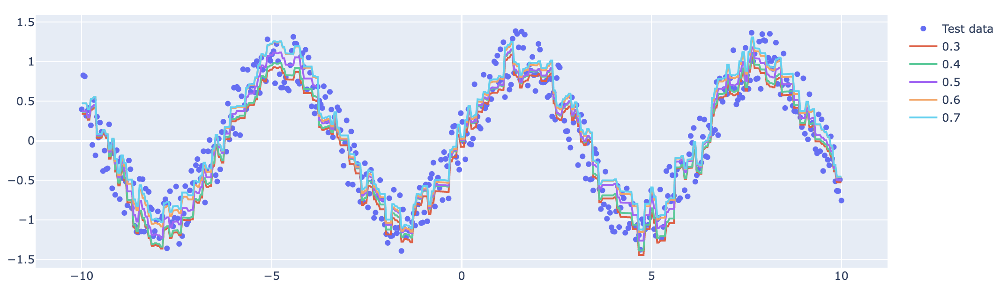

[이전 포스팅](../qr-lgb/)에서는 quantile regression과 LightGBM으로 여러 개의 quantile을 동시에 추정할 때 발생하는 문제점에 대해서 소개했다. 이번 포스팅에서는 LightGBM을 활용하여 동시에 Multiple quantile을 추정하며, Crossing problem을 방지할 수 있는 방법에 대해 서술한다. 물론 모든 코드는 [RektPunk/Lightgbm-monotone-quantile](https://github.com/RektPunk/Lightgbm-monotone-quantile)에 작성되어 있다. 


LightGBM을 사용하여 multiple quantile regression을 어떻게 적합할 수 있을까? 많은 방법이 있겠지만 [Cannon](https://link.springer.com/article/10.1007/s00477-018-1573-6)의 접근법을 이용, Tree 모델에 적용시켜봤다.
먼저, 아래처럼 학습 데이터를 입력 quantile들의 개수만큼 복제하는 함수를 만들었다.
또한, 함수 안쪽에서 복제한 설명변수 데이터에 `_tau` 열을 만들어서 quantile을 넣어줬다.

```python
from typing import List, Union, Dict, Any, Tuple
from functools import partial
from itertools import repeat, chain

import numpy as np
import lightgbm as lgb
import pandas as pd

def _prepare_x(
    x: Union[pd.DataFrame, pd.Series, np.ndarray],
    alphas: List[float],
) -> pd.DataFrame:
    if isinstance(x, np.ndarray) or isinstance(x, pd.Series):
        x = pd.DataFrame(x)
    assert "_tau" not in x.columns, "Column name '_tau' is not allowed."
    _alpha_repeat_count_list = [list(repeat(alpha, len(x))) for alpha in alphas]
    _alpha_repeat_list = list(chain.from_iterable(_alpha_repeat_count_list))
    _repeated_x = pd.concat([x] * len(alphas), axis=0)

    _repeated_x = _repeated_x.assign(
        _tau=_alpha_repeat_list,
    )
    return _repeated_x


def _prepare_train(
    x: Union[pd.DataFrame, pd.Series, np.ndarray],
    y: Union[pd.Series, np.ndarray],
    alphas: List[float],
) -> Dict[str, Union[pd.DataFrame, np.ndarray]]:
    _train_df = _prepare_x(x, alphas)
    _repeated_y = np.concatenate(list(repeat(y, len(alphas))))
    return (_train_df, _repeated_y)
```

다음으로, LightGBM에서는 custom loss 를 제공한다.
Custom loss는 결과로 gradient, hessian을 반환하는 함수 형태를 가지고 있다.
그래서 multiple quantile regression을 위한 loss를 다음과 같이 정의했다.

```python
def _alpha_validate(
    alphas: Union[List[float], float],
) -> List[float]:
    if isinstance(alphas, float):
        alphas = [alphas]
    return alphas


def _grad_rho(u, alpha) -> np.ndarray:
    return -(alpha - (u < 0).astype(float))


def check_loss_grad_hess(
    y_pred: np.ndarray, dtrain: lgb.basic.Dataset, alphas: List[float]
) -> Tuple[np.ndarray, np.ndarray]:
    _len_alpha = len(alphas)
    _y_train = dtrain.get_label()
    _y_pred_reshaped = y_pred.reshape(_len_alpha, -1)
    _y_train_reshaped = _y_train.reshape(_len_alpha, -1)

    grads = []
    for alpha_inx in range(_len_alpha):
        _err_for_alpha = _y_train_reshaped[alpha_inx] - _y_pred_reshaped[alpha_inx]
        grad = _grad_rho(_err_for_alpha, alphas[alpha_inx])
        grads.append(grad)

    grad = np.concatenate(grads)
    hess = np.ones(_y_train.shape)

    return grad, hess
```
check loss는 미분 불가능함수지만, subgradient를 반환했고, hessian은 1로 두었다.
이를 통해, first-order optimization method 중 하나인 subgradient방법으로 학습할 수 있다.


위의 함수들을 모아서 `MonotoneQuantileRegressor` class를 만들고, `train`, `pred` method를 생성했다.
Neural network 에서처럼 Weight를 직접 양수를 만족하게 만들 수는 없지만, 
LightGBM 에서는 특정 열과 예측 값이 Monotone 하도록 하는 제약을 hyperparameter로 추가할 수 있다. [링크](https://lightgbm.readthedocs.io/en/latest/Parameters.html#monotone_constraints)
따라서, train 과정에서 입력 params 에 `_tau`열과 예측값이 monotone 하도록 params를 update 한다.
```python
class MonotonicQuantileRegressor:
    def __init__(
        self,
        x: Union[pd.DataFrame, pd.Series, np.ndarray],
        y: Union[pd.Series, np.ndarray],
        alphas: Union[List[float], float],
    ):
        alphas = _alpha_validate(alphas)
        self.x_train, self.y_train = _prepare_train(x, y, alphas)
        self.dataset = lgb.Dataset(data=self.x_train, label=self.y_train)
        self.fobj = partial(check_loss_grad_hess, alphas=alphas)

    def train(self, params: Dict[str, Any]) -> lgb.basic.Booster:
        self._params = params.copy()
        if "monotone_constraints" in self._params:
            self._params["monotone_constraints"].append(1)
        else:
            self._params.update(
                {
                    "monotone_constraints": [
                        1 if "_tau" == col else 0 for col in self.x_train.columns
                    ]
                }
            )
        self.model = lgb.train(
            train_set=self.dataset,
            verbose_eval=False,
            params=self._params,
            fobj=self.fobj,
            feval=self.feval,
        )
        return self.model

    def predict(
        self,
        x: Union[pd.DataFrame, pd.Series, np.ndarray],
        alphas: Union[List[float], float],
    ) -> np.ndarray:
        alphas = _alpha_validate(alphas)
        _x = _prepare_x(x, alphas)
        _pred = self.model.predict(_x)
        _pred = _pred.reshape(len(alphas), len(x))
        return _pred
```

이젠 실험이다. 예제는 [이전 포스팅](../qr-lgb) 에서 사용했던 예제를 그대로 사용했다.

```python
sample_size = 500
params = {
    "max_depth": 4,
    "num_leaves": 15,
    "learning_rate": 0.1,
    "n_estimators": 100,
    "boosting_type": "gbdt",
}
alphas = [0.3, 0.4, 0.5, 0.6, 0.7]
x = np.linspace(-10, 10, sample_size)
x_test = np.linspace(-10, 10, sample_size)
y = np.sin(x) + np.random.uniform(-0.4, 0.4, sample_size)
y_test = np.sin(x_test) + np.random.uniform(-0.4, 0.4, sample_size)

monotonic_quantile_regressor = MonotonicQuantileRegressor(x=x, y=y, alphas=alphas)
model = monotonic_quantile_regressor.train(params=params)
preds = monotonic_quantile_regressor.predict(x=x_test, alphas=alphas)
preds_df = pd.DataFrame(preds).T
assert (preds_df.diff(axis = 1) < 0).sum(axis = 1).sum(axis = 0) == 0
```
마지막 assert를 통해 constraints가 제대로 동작하는지를 확인했다.
예측된 값은 아래의 시각화 코드를 통해 시각화했다.

```python
import plotly.graph_objs as go

fig = go.Figure(
    go.Scatter(
        x = x_test,
        y = y_test,
        mode = "markers",
    )
)
for pred in preds:
    fig.add_trace(go.Scatter(x=x_test, y=pred, mode="lines"))

fig.show()
```


성능 비교까지는 하지 않았지만, 개인적인 생각으로는 따로 적합하는 모델의 성능과 비슷하거나 더 떨어질 것으로 예상한다. 이유는 제약조건을 걸어 가능한 Model space를 축소시켰기 때문이다.

### 끝맺음
오늘은 Multiple quanitile을 LightGBM을 이용하여 추정하는 방법을 소개했다. 다른 문서에서는 Crossing problem을 중요하게 다루지 않고 기술된 경우가 많아서 위 코드를 [microsoft/LightGBM Issue #5727](https://github.com/microsoft/LightGBM/issues/5727)로 등록해서 유저들에게 공유했다. 비슷한 고민을 하고 있었던 유저들의 새로운 아이디어를 기대하고 있다. 
