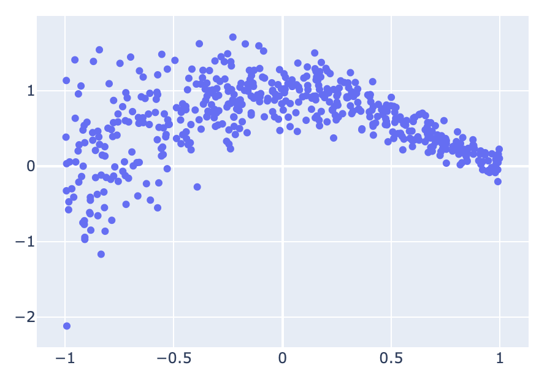
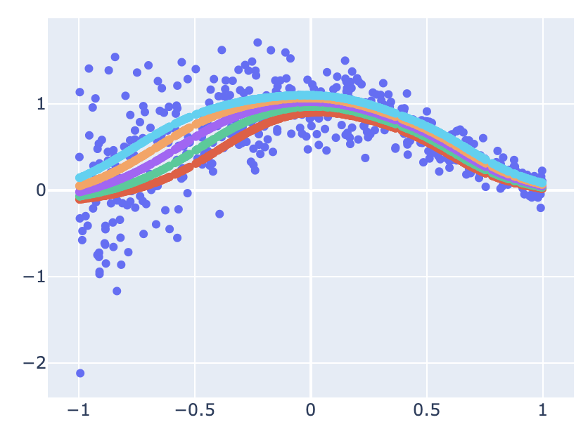

[이전 글](../mqr-tf-part1)에서는 Tensorflow를 이용하여 Multiple quantile을 추정하기 위한 모델을 구성하는 과정을 소개했다. 이번 글에서는 예제를 통해 모델을 적합해보고, 시각화해보도록 하겠다. 

마찬가지로 아래 코드들은 [RektPunk/mcqrnn-tf2](https://github.com/RektPunk/mcqrnn-tf2) 에서 확인할 수 있다.


### Example data
예제는 이번에는 조금 다른 예제를 사용해봤다.
x, y값을 다음과 같이 구성했다.
```python
# mcqrnn/generate_example.py
import numpy as np
from typing import Tuple


def _sincx(x: np.ndarray) -> np.ndarray:
    """
    Return sincx
    Args:
        x (np.ndarray): input x
    Returns:
        (np.ndarray): sinc(x)
    """
    _x_pi = np.pi * x
    return np.sin(_x_pi) / _x_pi


def generate_example(
    n_samples: int,
) -> Tuple[np.ndarray, np.ndarray]:
    """
    Generate dataset
    Args:
        x (int): number of samples
    Returns:
        Tuple[float32]: x, y
    """
    samples = np.random.uniform(low=-1, high=1, size=n_samples)
    reshaped_samples = np.reshape(samples, newshape=(n_samples, 1))
    sincx_samples = _sincx(samples)
    eps = np.random.normal(loc=0, scale=0.1 * np.exp(1 - samples))
    target = sincx_samples + eps
    return reshaped_samples.astype("float32"), target.astype("float32")
```

### Train
다음은 모델을 학습시켜야 한다.
학습을 위해서 아래 `train_step` 함수를 구성했다.

```python
# mcqrnn/train.py
import numpy as np
import tensorflow as tf


@tf.function
def train_step(
    model: tf.keras.Model,
    inputs: np.ndarray,
    output: np.ndarray,
    tau: np.ndarray,
    loss_func: tf.keras.losses.Loss,
    optimizer: tf.keras.optimizers,
):
    with tf.GradientTape(persistent=True) as tape:
        predicted = model(inputs, tau)
        loss = loss_func(output, predicted)

    grad = tape.gradient(loss, model.weights)
    optimizer.apply_gradients(zip(grad, model.weights))
    return loss

```
### Run
이전 글과 위에서 만들어둔 예제를 통해 다음과 같이 모델을 학습하고, 예측값을 반환할 수 있다.
```python
# run.py
import tensorflow as tf
import numpy as np
from mcqrnn import generate_example, train_step
from mcqrnn import (
    TiltedAbsoluteLoss,
    Mcqrnn,
    DataTransformer,
)

# Examples setting
EPOCHS = 2000
LEARNING_RATE = 0.05
TAUS = [0.3, 0.4, 0.5, 0.6, 0.7]
N_SAMPLES = 500
OUT_FEATURES = 10
DENSE_FEATURES = 10

x_train, y_train = generate_example(N_SAMPLES)
x_test, y_test = generate_example(N_SAMPLES)
taus = np.array(TAUS)
data_transformer = DataTransformer(
    x=x_train,
    taus=taus,
    y=y_train,
)
x_train_transform, y_train_transform, taus_transform = data_transformer()
mcqrnn_regressor = Mcqrnn(
    out_features=OUT_FEATURES,
    dense_features=DENSE_FEATURES,
    activation=tf.nn.sigmoid,
)
optimizer = tf.keras.optimizers.Adam(learning_rate=LEARNING_RATE)
tilted_absolute_loss = TiltedAbsoluteLoss(tau=taus_transform)
for epoch in range(EPOCHS):
    train_loss = train_step(
        model=mcqrnn_regressor,
        inputs=x_train_transform,
        output=y_train_transform,
        tau=taus_transform,
        loss_func=tilted_absolute_loss,
        optimizer=optimizer,
    )
    if epoch % 1000 == 0:
        print(epoch, train_loss)

x_test_transform, taus_transform = data_transformer.transform(
    x=x_test, input_taus=taus
)
y_test_predicted = mcqrnn_regressor(
    inputs=x_test_transform,
    tau=taus_transform,
)
y_test_predicted_reshaped = y_test_predicted.numpy().reshape(N_SAMPLES, len(TAUS)).T
```

### Visualization
결과를 시각화하면 아래와 같다.
```python
import plotly.graph_objects as go


x_test_reshaped = x_test.reshape(-1)
fig = go.Figure(
	go.Scatter(
    	x=x_test_reshaped, 
        y=y_test,
        mode="markers",
    )
)
fig.show()
```


```python
for pred in y_test_predicted_reshaped:
    fig.add_trace(
    	go.Scatter(
        	x=x_test_reshaped, 
            y=pred, 
            mode="markers",
        )
	)
fig.show()
```


### 끝맺음
성능 비교를 디테일하게 진행하지는 하지 않았지만, lightGBM과 같은 이유로, 개인적인 생각으로는 따로 적합하는 모델의 성능과 비슷하거나 더 떨어질 것으로 예상한다. 이유는 제약조건을 걸어 가능한 Model space를 축소시켰기 때문이다.

