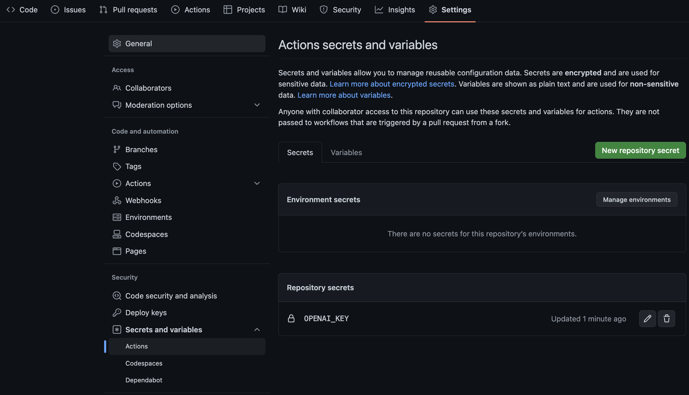
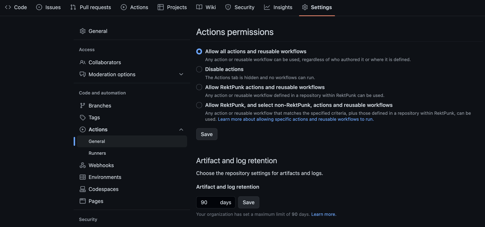
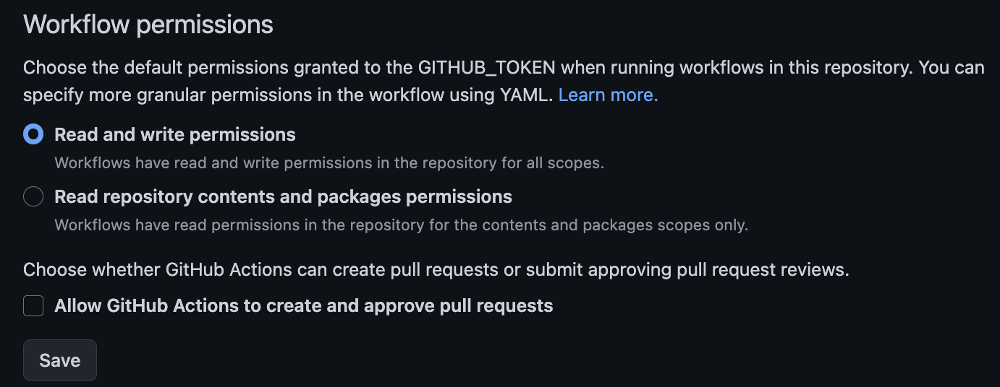
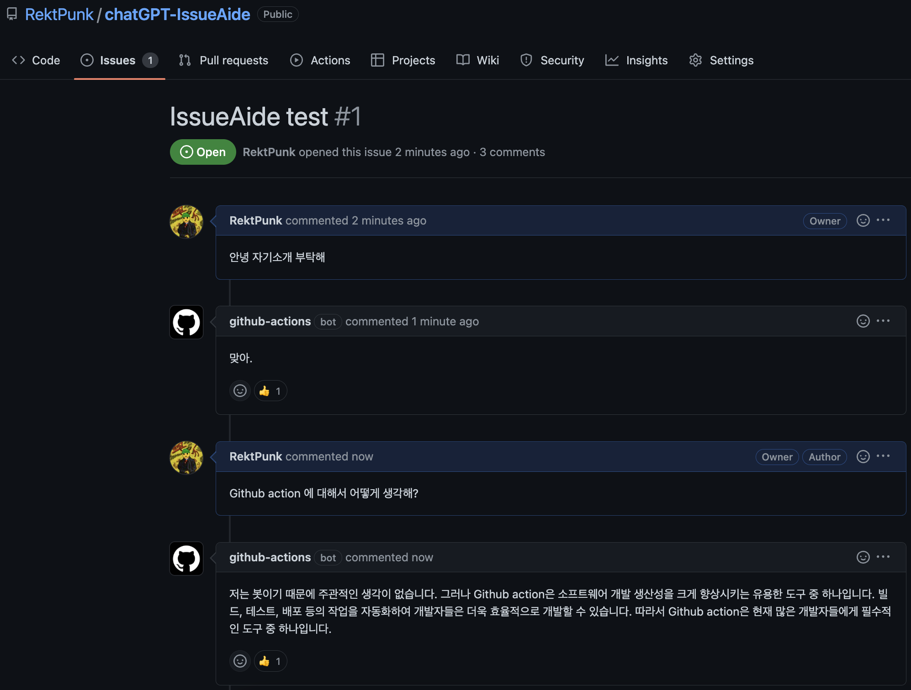
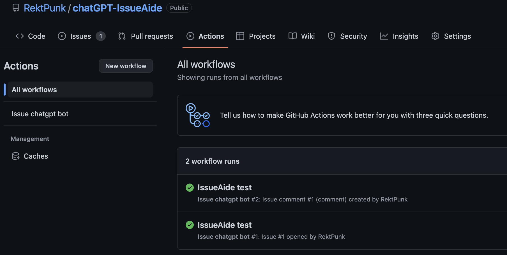

### TL;DR
openAI API Free trial이 써도써도 끝나지 않는다.
그래서 너무 한가하기도 하고 오기도 생기고 한 나머지 만들어봤다.
이름하여, Github issue QnA bot!
목표는 굉장히 단순하다.
> Github issue 에 ChatGPT를 붙여서 간단한 QnA 봇을 만든다.

생각보다 삽질을 많이 한것 같다.
이 문서는 진행하면서 겪었던 삽질들을 제외하고 동작에 필요한 내용만 정리했다. 물론 모든 코드는 [RektPunk/chatGPT-IssueAide](https://github.com/RektPunk/chatGPT-IssueAide)에 있으며 핵심적인 부분만 소개한다.

### Get response from openai
해당 부분은 이미 수많은 사람들이 만들어둔 코드가 많아서 엄청나게 수월하게 작성했다.
먼저, `openai` 모듈을 설치하고 아래처럼 코드를 작성했다.

```python
import argparse
import openai


def get_openai_response(input_text: str) -> str:
    ## open api key
    openai.api_key: str = "****" #FIXME
    response = openai.ChatCompletion.create(
        model="gpt-3.5-turbo",
        messages=[
            {"role": "system", "content": "너는 짧게 대답하는 봇이야."},
            {"role": "user", "content": input_text},
        ],
    )
    return response["choices"][0]["message"]["content"]


if __name__ == "__main__":
    parser = argparse.ArgumentParser()
    parser.add_argument("-i", "--input-text")
    args = parser.parse_args()
    print(get_openai_response(args.input_text))
```
이러면 대충, 아래와 같은 결과를 얻을 수 있다.

```bash
> python script/get_openai.py --input-text "자기소개 해봐"
안녕하세요! 저는 짧게 대답하는 인공지능 챗봇입니다. 
당신의 질문에 최대한 빠르게 답변을 제공하기 위해 만들어졌습니다. 
무엇이든 물어보세요!
```
"너는 짧게 대답하는 봇이야."는 최대한 간결하고 빠르게 대답하게 만들기 위해서 넣어줬다.
이제 남은건 저 script를 issue에 글을 작성할 때마다 돌리는 것뿐인데...
해당 부분에서 조금 삽질을 했다.

### Github action on issue
Issue에 글이 써질때마다 반응하도록 github action을 활용했다.
이것저것 생각해봤는데, 진짜 단순하게 만들고 싶어서 기본적인 action 들만 사용했다.
아래는 사용한 github action 들이다.
각 action이 수행할 행동은 굉장히 단순한데, 이는 action 옆쪽에 작성해뒀다.
- [checkout action](https://github.com/actions/checkout): 코드 복사
- [setup-python action](https://github.com/actions/setup-python): python 설치
- [run-python-script action](https://github.com/jannekem/run-python-script-action): python script 실행
- [create-or-update-comment action](https://github.com/peter-evans/create-or-update-comment): comment 작성

Action 별로 할 행동도 명확하니 이제 github action yaml을 구성한다.
```yaml
name: Issue chatgpt bot
on:
  issues:
    types: [opened]
  issue_comment:
    types: [created, edited]
```
라고 첫 부분을 설정해주어 해당 action이 issue comment를 작성 혹은 변경되면 수행하도록 했다. (issue가 생성될 때는 생략했다.)
다음은 jobs 인데,
```yaml
jobs:
  chatgpt_comment:
    runs-on: ubuntu-latest
    steps:
    ...(생략됨)
    - name: Get comment
      uses: jannekem/run-python-script-action@v1
      id: chatgpt_message
      with:
        comment-body: ${{ github.event.comment.body }}
        openai-key: ${{ secrets.OPENAI_KEY }}
        script: |
          import openai
          def get_openai_response(input_text: str) -> str:
            openai.api_key = get_input("openai-key")
            response = openai.ChatCompletion.create(
                model="gpt-3.5-turbo",
                messages=[
                    {"role": "system", "content": "너는 짧게 대답하는 봇이야."},
                    {"role": "user", "content": input_text},
                ],
            )
            return response["choices"][0]["message"]["content"]
          comment_body = get_input("comment-body")
          _message = get_openai_response(comment_body)
          set_output("message", _message)
    - name: Create comment
      uses: peter-evans/create-or-update-comment@v1
      with:
        issue-number: ${{ github.event.issue.number }}
        body: |
          ${{ steps.chatgpt_message.outputs.message }}
        reactions: '+1'
```
위쪽에서 작성한 script와 굉장히 흡사한데, 
`run-python-script-action@v1` 의 `get_input`, `set_output` 함수를 사용했다.
먼저 `${{ github.event.comment.body }}` 에는 작성한 comment의 text가 들어있어 이를 comment-body 로 저장했다.
`${{ secrets.OPENAI_KEY }}`는 아래처럼 repository의 secrets 에 추가해줬다.



마지막으로.. 해당 부분 때문에 이것저것 삽질했는데,
Workflow가 Read and write 를 가능하도록 설정해줘야 한다. 
이는 아래의 페이지에 더 아래쪽에 있으며,


아래와 같이 설정해줘야 한다.


끝! 이제 제대로 동작하는지 테스트해보자.



~~맞긴 뭐가 뭐가 맞아~~

Github actions 도 무사히 돌았다는 것을 확인할 수 있다.


이렇게 엄청나게 단순하게 Github issue 에서 QnA가 가능하도록 해봤다.
Github issue 가 대답하도록 했다.
근데.. "맞아."는 좀 건방진 것 같다. 그러므로.. 당분간 괴롭혀줄 예정이다. 


### Conclusion

사실 굳이 Github issue에 QnA 봇을 만들 필요는 없다.
하지만 재미있으면.. 그만이다..


