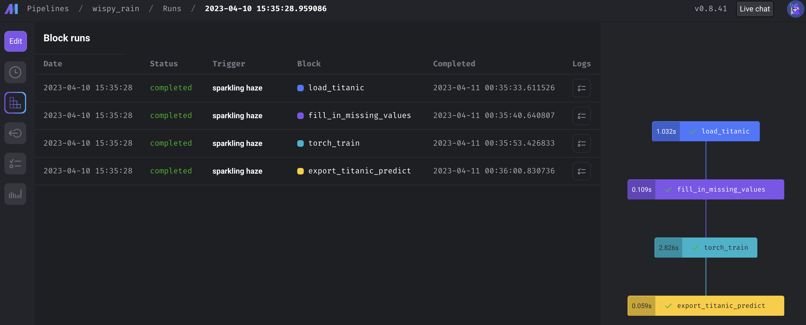

데이터 pipeline은 쉽고도 어렵다. 현재, 실무에서는 Airflow를 사용하고 있다. 
그러나, 데이터 과학자로서 존경하고 사랑하는 데이터 엔지니어의 도움 없이는 Test 환경 구축은 꿈꾸기 어려웠을 것이다. 또한, 막상 만들어둔 Task나 Task group 에서 바로바로 결과 확인이 어려운 편이다 (내 실력 문제라고 생각한다.)
그러던 중, 동료 엔지니어로부터 [mage.ai](https://www.mage.ai/)라는 데이터 pipeline 툴을 소개받았다.
따라서 이번 글에서는 해당 툴을 아주 가볍게 사용해보고자 한다. 다른 글과 마찬가지로 코드는 [RektPunk/mage-ai-example](https://github.com/RektPunk/mage-ai-example)에 정리해뒀다.

### Quick start
나는 코드가 두려운 비 개발자이기 때문에 공식 Document대로 설치해본다.
Docker나 pip, conda를 사용하여 설치할 수 있다. 
아래처럼 Docker를 통해 설치하는 것을 권장하고는 있지만
```bash
docker run -it -p 6789:6789 -v $(pwd):/home/src mageai/mageai \
  /app/run_app.sh mage start demo_project

```
Docker 설치도 귀찮고 혼자 가지고 놀꺼기 때문에 pip 으로 설치했다.
```bash
pip install mage-ai
```
Conda 를 통해 설치하려면 아래처럼 설치하면 된다.
```bash
conda install -c conda-forge mage-ai
```

설치한 후에는 mage 를 본격적으로 실행하면 되는데, project 이름을 고민하다가 `spellbook` 이라는 이름을 쓰기로 결정했다.
```bash
mage start spellbook
```

그러면 뭔가 파일과 함수들을 쭉 만들어주면서 `http://localhost:6789/` 에서 확인할 수 있게 된다. 그리고, example_pipeline 이라는 예제 pipeline이 있지만 예제에 연연하지 않고 지워줬다.


굿. 아주 깔끔하다.
왼쪽에 있는 바는 차례로
```
- Pipelines
- Triggers
- Pipeline runs
- Terminal
- Settings
```

를 나타낸다. 자 이제 대충 pipeline을 만들어보자.

### Pipelines

pipeline을 생성하는 방법은 굉장히 단순한데 `+New` 를 클릭해주면 된다.
세 가지 선택지 중에서 `Standard(batch)` 를 선택해줬다.


그럼 이런식으로, 첫 화면을 볼 수 있다. 그리고, 코드 에디터를 살펴보면


이런 파이프라인이 새로 생기는데, pipeline을 구성한 뒤에 `metadata.yaml` 을 다시 살펴보도록 하겠다.

첫 화면에서, `Data loader`, `Transformer`, `Data exporter` 등을 클릭해보면 수많은 옵션들을 확인해볼 수 있는데, 예를 들어 아래처럼 Google BigQuery를 선택하고 block name을 결정해주면, 


위와 같은 그림처럼 `data_loader` 폴더에 block name의 `.py`가 생기고, 예제 코드가 생성됨을 확인할 수 있다. 이는 즉, pipeline을 function 형태로 구성하고 이를 연결하는 방식으로 mage.ai 가 동작함을 유추해볼 수 있다.
반대로, `data_loaders` 폴더에서 `load_titanic.py`를 보면 아래와 같다.


여기서 `Add to current pipeline` 을 선택하면 자연스럽게 현재의 파이프라인에 추가가 된다. 마찬가지로, `transformers` 폴더에 있는 `fill_in_missing_values.py`와  `data_exporters` 폴더에 있는 `export_titanic_predict.py` 를 current pipeline에 추가해보자.


그러면 대략 이런 형태가 되는데, 해당 block 들의 Dependency를 지정해주는 방법을 소개한다. 먼저, 블록 상단의 `Edit parent blocks` 를 클릭한 뒤, parent block을 Tree에서 클릭하면 dependency가 생긴다.


혹은, Tree에서 직접 해당 block 들의 dependency를 지정해줄 수도 있다.
여기에서, 이 툴이 model pipeline 로도 사용가능하지 않을까 라는 생각을 했다.
그래서, 아래처럼 대충 모델을 `custom`으로 하나 생성했다.

```python
import pandas as pd
import torch
from torch import nn
from torch.utils.data import DataLoader
from spellbook.utils.variables import (
    X_COLS,
    Y_COLS,
    BATCH_SIZE,
    LEARNING_RATE,
    EPOCHS,
)


if "custom" not in globals():
    from mage_ai.data_preparation.decorators import custom
if "test" not in globals():
    from mage_ai.data_preparation.decorators import test


class NeuralNetwork(nn.Module):
    def __init__(self, n_features: int):
        super().__init__()
        self.linear_relu_stack = nn.Sequential(
            nn.Linear(n_features, 10), nn.ReLU(), nn.Linear(10, 1), nn.Sigmoid()
        )

    def forward(self, x):
        probs = self.linear_relu_stack(x)
        return probs


def _model_save():
    """
    save model some place
    """
    pass


@custom
def torch_train(df: pd.DataFrame, *args, **kwargs) -> pd.DataFrame:
    """
    Returns:
        pd.DataFrame
    """
    # some model code

    x_train = df[X_COLS]
    y_train = df[Y_COLS]
    x_train_tensor = torch.Tensor(x_train.to_numpy())
    y_train_tensor = torch.Tensor(y_train.to_numpy())

    x_train_dataloader = DataLoader(x_train_tensor, batch_size=BATCH_SIZE)
    y_train_dataloader = DataLoader(y_train_tensor, batch_size=BATCH_SIZE)

    some_nn = NeuralNetwork(x_train.shape[1])
    loss_fn = nn.CrossEntropyLoss()
    loss_fn = nn.BCELoss()
    optimizer = torch.optim.SGD(some_nn.parameters(), lr=LEARNING_RATE)

    for _ in range(EPOCHS):
        for (_, _x), (_, _y) in zip(
            enumerate(x_train_dataloader), enumerate(y_train_dataloader)
        ):
            pred = some_nn(_x)
            loss = loss_fn(pred, _y)
            optimizer.zero_grad()
            loss.backward()
            optimizer.step()
    _model_save()
    _pred = some_nn(x_train_tensor).round().detach().numpy()
    df = df.assign(Survived_predict=_pred.astype(int))
    return df


@test
def test_output(output, *args) -> None:
    """
    Template code for testing the output of the block.
    """
    assert output is not None, "The output is undefined"
```
참고로, `variables.py`는 아래와 같이 변수들만 모아서 저장해둔 파일이다.
```python
# variables.py
TITANIC_DATA_URL = (
    "https://raw.githubusercontent.com/datasciencedojo/datasets/master/titanic.csv"
)
X_COLS = [
    "Age",
    "Fare",
    "Parch",
    "Pclass",
    "SibSp",
]
Y_COLS = [
    "Survived",
]
COLS = X_COLS + Y_COLS
BATCH_SIZE = 64
LEARNING_RATE = 1e-3
EPOCHS = 100
```
그리고, `torch` 를 사용할꺼기 때문에, `spellbook`의 `requirements.txt`에 `torch`를 추가해줬다.


마찬가지로 Add current pipeline으로 추가하여, 아래처럼 pipeline을 구성했다.

이렇게 pipeline을 추가하면, `metadata.yaml` 파일이 생성됨을 알 수 있고, 이러한 파일들을 만들면 UI 를 통해서 pipeline을 구성하지 않아도 될 것이라고 예측해 볼 수 있다. (안해봤다.) 또한, pipeline을 구성하면서 각 block 이 동작하는 것을 실행 버튼을 눌러 확인해볼 수 있다.


### Pipeline triggers

이제 만들어진 pipeline을 직접 실행해보자. Pipeline을 만들면서도 실행 버튼을 눌러 각각의 block이 잘 동작함을 테스트할 수도 있고, 이렇게 Triggers 탭에서 `Run pipeline now`를 눌러 직접 파이프라인을 실행시킬 수도 있다.


실행이 된다면, Block runs 탭에서 각 block 중에 어디서 문제가 발생했는지, 얼마나 시간이 걸렸는지를 체크해볼 수 있으며, 더 깊게는 Logs 를 확인하여 어떤 문제가 발생했는지를 체크할 수 있다.




마지막으로, Trigger를 다양한 옵션으로도 조절할 수 있다. 이 옵션들은 다음과 같다.


### 끝맺음
오늘은 mage.ai를 어떻게 사용하는 건지 찍먹해봤다.
아직, 깊게 사용해보진 않았지만 dbt, streaming 등 사용할 수 있는 옵션이 매우 많은것 같다.


