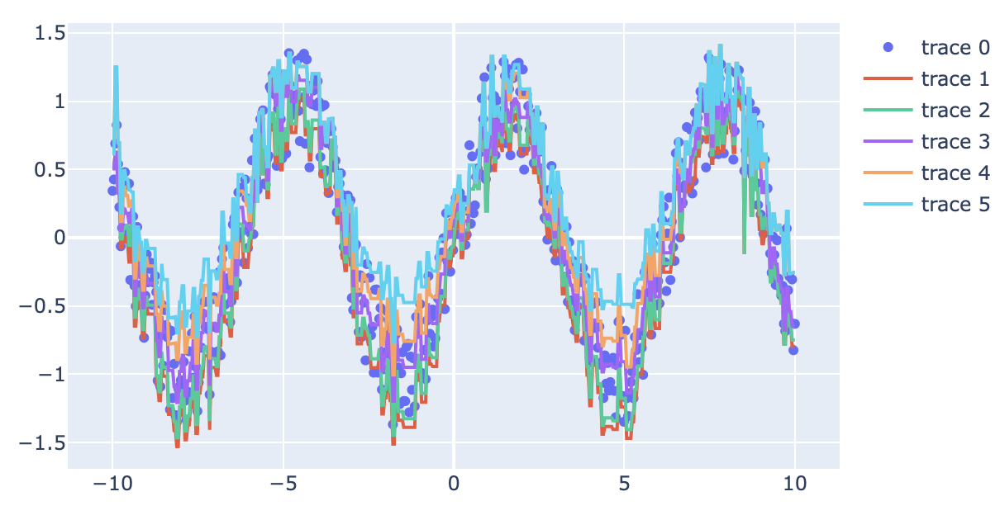

### TL;DR
이번 글에서는 XGBoost에도 Monotone quantile regressor를 만드는 과정을 소개한다. 엄청나게 LightGBM에 적용한 방식과 유사하지만..
고로, 자세한 설명은 [LightGBM 글](../mqr-lgb)를 봐주시면 되겠다. 코드는 [RektPunk/quantile-tree](https://github.com/RektPunk/quantile-tree)에 작성해두었다.

### How?
여러 작업에 치여살던 중 갑자기 잠들기전에 생각이 났다. LightGBM에서도 가능하면, 비슷한 tree 모델인 XGBoost에서도 quantile regression이 가능하지 않을까? 졸린 눈을 한 채로 검색해보니 오? 비슷하게 `monotone_constraints` 라는게 존재하고 `tuple`로 처리한다는 점만 다르다. 심지어 Custom objective function도 grad, hess를 반환하도록 구성하면 된다는 것도 확인했다. 또 dataset을 `xgb.DMatrix`로 쓰면 된다는 사소한 차이점까지 확인했다. 결론은 이전 [LightGBM 글](../mqr-lgb)에서 아주 살짝만 바꾸면 끝날거 같아서 시작했다. 

```python
# module/model.py
class MonotonicQuantileRegressor:
    """
    Monotone quantile regressor which preserving monotonicity among quantiles
    Attributes
    ----------
    x: Union[pd.DataFrame, pd.Series, np.ndarray]
    y: Union[pd.Series, np.ndarray]
    alphas: Union[List[float], float]

    Methods
    -------
    train
    predict
    """

    def __init__(
        self,
        x: Union[pd.DataFrame, pd.Series, np.ndarray],
        y: Union[pd.Series, np.ndarray],
        alphas: Union[List[float], float],
    ):
        alphas = _alpha_validate(alphas)
        self.x_train, self.y_train = _prepare_train(x, y, alphas)
        self.dataset = xgb.DMatrix(data=self.x_train, label=self.y_train)
        self.obj = partial(check_loss_grad_hess, alphas=alphas)

    def train(self, params: Dict[str, Any]) -> xgb.Booster:
        """
        Train regressor and return model
        Args:
            params (Dict[str, Any]): params of xgb

        Returns:
            xgb.Booster:
        """
        self._params = params.copy()
        if "monotone_constraints" in self._params:
            _monotone_constraints = self._params["monotone_constraints"]
            _monotone_constraints.append(1)
            self._params["monotone_constraints"] = tuple(_monotone_constraints)
        else:
            self._params.update(
                {
                    "monotone_constraints": tuple(
                        [1 if "_tau" == col else 0 for col in self.x_train.columns]
                    )
                }
            )
        self.model = xgb.train(
            dtrain=self.dataset,
            verbose_eval=False,
            params=self._params,
            obj=self.obj,
        )
        return self.model

    def predict(
        self,
        x: Union[pd.DataFrame, pd.Series, np.ndarray],
        alphas: Union[List[float], float],
    ) -> np.ndarray:
        """
        Predict x with alphas
        Args:
            x (Union[pd.DataFrame, pd.Series, np.ndarray])
            alphas (Union[List[float], float])

        Returns:
            np.ndarray
        """
        alphas = _alpha_validate(alphas)
        _x = _prepare_x(x, alphas)
        _x = xgb.DMatrix(_x)
        _pred = self.model.predict(_x)
        _pred = _pred.reshape(len(alphas), len(x))
        return _pred
```

바뀐 부분은 단순하게 `DMatrix`로 데이터 변형해주고, `monotone_constraints`를 tuple로 변경해준 것 밖에..?
마침 `DMatrix`도 `get_label()` 사용할 수 있길래 옳다구나 하고 슈슉 만들었다.

### Experiment

자, 이제 동작만 테스트 해보자.
```python
import numpy as np
import plotly.graph_objects as go
from module.model import MonotonicQuantileRegressor

if __name__ == "__main__":
    sample_size = 500
    alphas = [0.3, 0.4, 0.5, 0.6, 0.7]
    params = {
        "learning_rate": 0.65,
        "max_depth": 10,
    }
    x = np.linspace(-10, 10, sample_size)
    y = np.sin(x) + np.random.uniform(-0.4, 0.4, sample_size)
    x_test = np.linspace(-10, 10, sample_size)
    y_test = np.sin(x_test) + np.random.uniform(-0.4, 0.4, sample_size)

    monotonic_quantile_regressor = MonotonicQuantileRegressor(
        x=x, y=y_test, alphas=alphas
    )
    model = monotonic_quantile_regressor.train(params=params)
    preds = monotonic_quantile_regressor.predict(x=x_test, alphas=alphas)

    fig = go.Figure(
        go.Scatter(
            x=x_test,
            y=y_test,
            mode="markers",
        )
    )
    for _pred in preds:
        fig.add_trace(go.Scatter(x=x_test, y=_pred, mode="lines"))
    fig.show()
```

생각했던 것보다 잘 동작해서 너무 놀랐다. ~~이게 왜 돼?~~ 물론 성능은 언제나 그렇듯 신경쓰지 않지만.. 작은 페이퍼로 내면 될지도?


### Conclusion
여러 유저가 crossing 문제로 고통받고 있는데 Issue에는 누가 질문해도 close하길래 [XGBoost discuss 페이지](https://discuss.xgboost.ai/t/multiple-quantile-regression-with-preserving-monotonicity-non-crossing-condition/3655)에 올려뒀다. 
