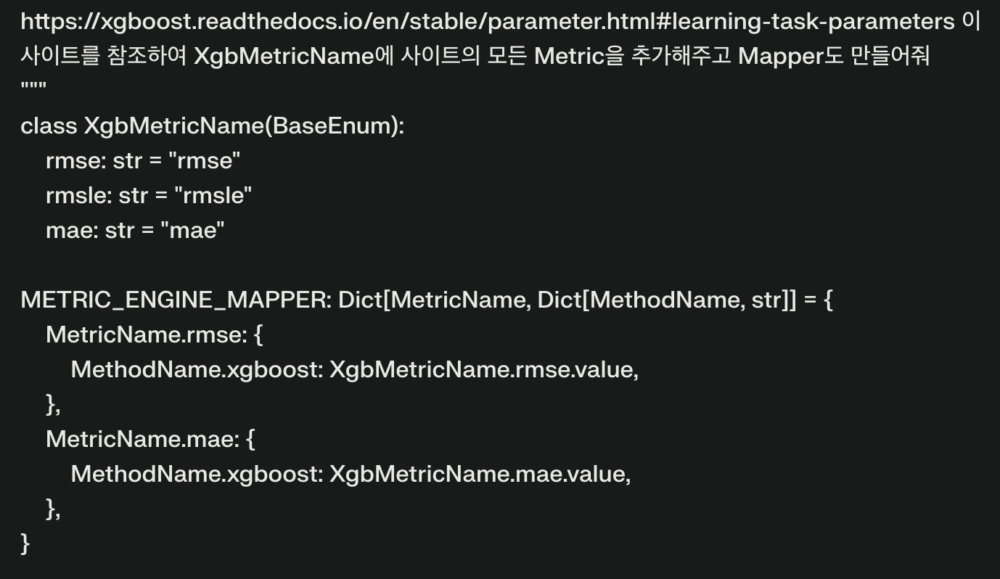
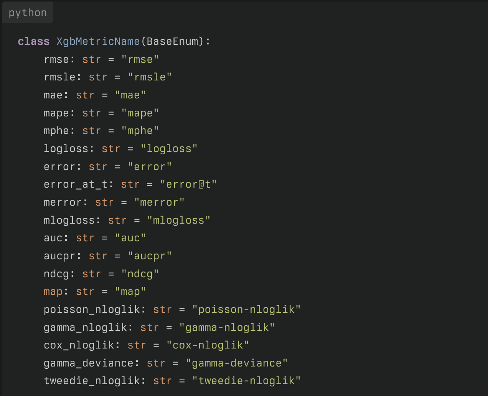

### 선요약 TL;DR 이라고 하던가
많은 Data scientist 는 아직도 테이블 데이터와 씨름한다.
어떤 목적함수를 써야 좋고 어떤 hyperparameter를 써야 성능 개선이 되고 블라블라...

아 복잡해, 이 모든걸 딸깍 해버리고 싶다..
그래서 직접 만들었다 **[RektGBM](https://github.com/RektPunk/RektGBM)** ~~반쯤 썩은 GBM~~.

설치는 이렇게!
```bash
pip install rektgbm	
```
어떤 task든(Regression, binary multiclass classification, rank) 모두 이렇게!
```python
from rektgbm import RektDataset, RektGBM, RektOptimizer
...
dtrain = RektDataset(data=X_train, label=y_train)
dtest = RektDataset(data=X_test, label=y_test)

rekt_optimizer = RektOptimizer()
rekt_optimizer.optimize_params(dataset=dtrain, n_trials=100)
print(rekt_optimizer.best_params)
rekt_gbm = RektGBM(**rekt_optimizer.best_params)
rekt_gbm.fit(dataset=dtrain)
preds = rekt_gbm.predict(dataset=dtest) #DONE!
```
당신이 해야할 일은 오직 데이터만 읽는것이다!


### 미약한 시작

언제나 그렇듯 모델을 만들고 실험하는 일은 너무나 귀찮다.
찾아봐도 뭔가 쇼쇼쇽 해주는 건 찾기 힘들었다.
그래서 귀찮음을 해결하기 위해 직접 만들기를 결심하고 몇 가지 질의응답을 해봤다.

Q) 모델들 너무 많은데.. 무슨 모델을 쓰지? \
A) 생각해보니 사용하는 모델은 굉장히 한정적이네, [Lightgbm](https://github.com/microsoft/LightGBM) 이나 [XGBoost](https://github.com/dmlc/xgboost) 이니까.

Q) Hyperparameter는 그럼 어떻게 해? \
A) [Optuna](https://github.com/optuna/optuna) 를 쓰자!

Q) Regressor, Classfier, Ranker 다 나뉘어 있는건 어떻게 처리하지? \
A) `scikit-learn API`를 안쓰고 기본 API만 쓰면 되잖아.

> **그럼 둘이 차이점만 파악하면 다 묶어서 만들 수 있을거 같은데?**

### 일단 그냥 해보자 (Dataset, Engine)
`train`, `predict`가 중요하긴 하다만 그보다 더 먼저 생각해야 할건 데이터셋이다.
각 Document를 비교해서 살펴보니 train에선 XGBoost:`xgb.DMatrix`, lightgbm:`lgb.Dataset`을 선택하게 구성하도록 되어있고, 
predict에선 xgboost는 그대로 lightgbm은 `lgb.Dataset`을 쓰지 말고 원본을 넣으라 한다.
```python
...
_METHOD_FUNC_TYPE_MAPPER = {
    "lightgbm": {
        "train_dtype": lgb.Dataset,
        "predict_dtype": lambda data: data,
    },
    "xgboost": {
        "train_dtype": xgb.DMatrix,
        "predict_dtype": xgb.DMatrix,
    },
}

def _get_dtype(method, dtype):
	"""함수형태 반환"""
    _funcs = _METHOD_FUNC_TYPE_MAPPER.get(method)
    return _funcs.get(dtype)


@dataclass
class RektDataset:
    data
    label = None
    
    def __post_init__(self) -> None:
        if not isinstance(self.data, pd.DataFrame):
            self.data = pd.DataFrame(self.data)

    def dtrain(self, method):
    	"""train 데이터 형태"""
        train_dtype = _get_dtype(
            method=method,
            dtype="train_dtype",
        )
        return train_dtype(data=self.data, label=self.label)

    def dpredict(self, method):
    	"""predict 데이터 형태"""
        predict_dtype = _get_dtype(
            method=method,
            dtype="predict_dtype",
        )
        return predict_dtype(data=self.data)
```

다음으론 `train`, `predict` 실제로 할 Engine을 만들어줬다. 
Document를 보니 `lgb.train`, `xgb.train` 으로 학습할 수 있고 입력값만 살짝 바꿔주면 된다. 따라서 Engine에서는 `fit`, `predict`를 어떤 방법을 쓰냐로 구분해서 만들어주면 되었다. 
```python
class RektEngine(BaseGBM):
    def __init__(
        self,
        method,
        params,
    ):
        self.method = method
        self.params = params

    def fit(
        self,
        dataset,
        valid_set,
    ):
        dtrain = dataset.dtrain(method=self.method)
        dvalid = valid_set.dtrain(method=self.method)

        if self.method == "lightgbm":
            self.model = lgb.train(
                train_set=dtrain,
                params=self.params,
                valid_sets=dvalid,
                valid_names="validation",
            ) # 얘는 여기에 validation loss 가 들어있다.
        elif self.method == "xgboost":
            evals_result = {} # xgboost는 이렇게 validation loss 저장
            self.model = xgb.train(
                dtrain=dtrain,
                verbose_eval=False,
                params=self.params,
                evals_result=evals_result,
                evals=[(dvalid, "validation")],
            )
            self.evals_result = evals_result

    def predict(
        self,
        dataset,
    ):
    	dpredict = dataset.dpredict(method=self.method)
        return self.model.predict(data=dpredict)
```

이제 Engine 밖에서 Task 별로 Objective, Metric을 설정해주면 된다.
왜 이리도 쉬운걸,,, 라고 생각했지만 여기서부턴 조금 두뇌를 써야만 했다.

### Task 는 어떻게 찾지?
다행히도, Y값을 보고 무슨 task일지 추정해주는 함수가 있더라
`sklearn`의 `type_of_target` 함수다. 얘를 이용해서 regression, binary claasification, multiclass classification 등 task를 특정할 수 있었다. 
(물론 rank는 다르게 처리했다..)

### Objective, Metric 은 어떻게 설정하지?
Objective, metric은 어떻게 하지..? 아이디어는 공통의 objective, metric 을 만들고 각 알고리즘마다 해당하는 objective, metric 으로 mapping 해주려고 했다. 그런데 제공하는 objective metric의 수가 보통이 아니여서, 초안은 동료의 추천대로 [Perplexity](https://www.perplexity.ai/)를 써서 정리하기로 마음먹었다. ~~딸깍~~


~~AI는 신인가?~~ 감사합니다... 감사합니다...

### 이제 Optimizer 의 차례다.
objective, metric이 정의 되었으니 각 모델마다 hyperparameter tuning을 돌리고 각각의 best 모델을 뽑는다. 그 다음으로 둘중 최고존엄 모델을 뽑아서 해당하는 model, param 정보를 다시 넣어줘서 학습하면 그게 best of best 모델이 될터였다. Hyperparameter tuning은 익숙한 Optuna를 선택했다.Optimizer의 중요한 method는 다음과 같다.
```python
def optimize_params(
    self,
    dataset,
    n_trials,
    valid_set=None,
):
    self._task_type = check_task_type( ### task type 추정
        target=dataset.label,
        group=dataset.group,
        task_type=self.task_type,
    )
    self.rekt_objective = RektObjective( ### objective mapping
        task_type=self._task_type,
        objective=self.objective,
    )
    self.rekt_metric = RektMetric( ### metric mapping
        task_type=self._task_type,
        objective=self.rekt_objective.objective,
        metric=self.metric,
    )
    if valid_set is None:
    	### split; 쪼개는 method도 만들었다.
        dataset, valid_set = dataset.split(task_type=self._task_type)

    self.studies = {}
    for method, param in zip(self.method, self.params):
        _objective = self.rekt_objective.get_objective_dict(method=method)
        _metric = self.rekt_metric.get_metric_dict(method=method)
        def _study_func(trial):
            _param = param(trial=trial)
            _param.update({**_objective, **_metric})
            _engine = RektEngine(
                params=_param,
                method=method,
            )
            _engine.fit(dataset=dataset, valid_set=valid_set)
            return _engine.eval_loss ### 이것도 추가됨;

        study = optuna.create_study(
            study_name=f"Rekt_{method}",
            direction="minimize",
            load_if_exists=True,
        )
        study.optimize(_study_func, n_trials=n_trials)
        self.studies.update({method: study})

```
여기까지 만들고 이정도면 충분히 사용가능하겠다고 생각했다. 그럼 이제!


### 쓸만한가?
~~이게 나한텐 딸깍이야~~
```python
from rektgbm import RektDataset, RektGBM, RektOptimizer
...
dtrain = RektDataset(data=X_train, label=y_train)
dtest = RektDataset(data=X_test, label=y_test)

rekt_optimizer = RektOptimizer()
rekt_optimizer.optimize_params(dataset=dtrain, n_trials=100)
print(rekt_optimizer.best_params)
rekt_gbm = RektGBM(**rekt_optimizer.best_params)
rekt_gbm.fit(dataset=dtrain)
preds = rekt_gbm.predict(dataset=dtest)
```
글로는 작성하지 않았지만 위 코드엔 입력 데이터에 대한 레이블 인코딩 등 Data scientist로 일하며 얻은 잡지식을 그득히 담아뒀다.


### 근데 이거.. 다른데에서도 쓰고 싶은데..


[Poetry](https://python-poetry.org/) 를 쓰고 있어서 그런지 배포는 정말 간단했다. 
Github action 중에 publish가 있길래 tag 달고 push하면 배포하도록 구성했다.
```yaml
name: Publish Python Package

on:
  push:
    tags:
      - 'v*.*.*'

jobs:
  release:
    runs-on: ubuntu-latest

    steps:
    - name: Checkout repository
      uses: actions/checkout@v4

    - name: Publish module
      uses: JRubics/poetry-publish@v2.0
      with:
        pypi_token: ${{ secrets.PYPI_TOKEN }}
        poetry_install_options: "--without dev"
```
어째저째 암튼 이렇게 됐으니 
```bash
pip install rektgbm	
```
으로 쓰면 사용가능하다. 물론, 거대한 버그 덩어리겠지만 뭐 
계속 고치다 보면 나아지겠지..! test code 도 만들고 말이지..

혹시라도 얘가 이상한 짓을 한다면 [이슈](https://github.com/RektPunk/RektGBM/issues)에 남겨 주시거나 pr 주시면 너무나도 감사합니다!

끗!

